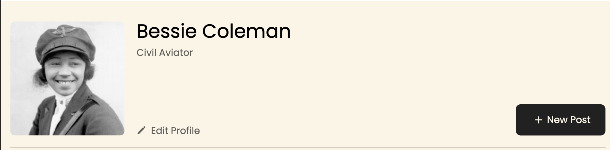
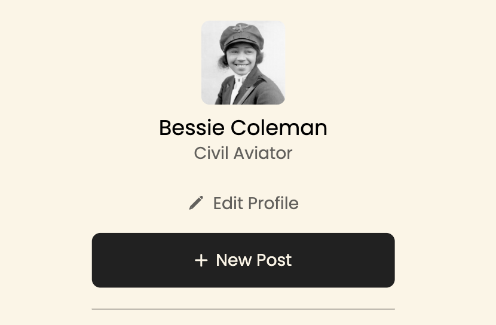

# Project 3: Spots

### Overview

1. Project's Name: Spots
2. This project was completed to show my ability to use the grid layout and media queries.
3. The technologies used to complete this project was Figma, CSS, HTML, and Chrome's DevTools.

## Images

Below are images from my project, along with explanations of the tools and technologies I used, and key lessons I learned along the way:

- Above is the desktop view of the website, displayed without the use of any media queries. This serves as the website's default layout.

- The image above shows the mobile view as it appears on a phone. The layout adapts by adjusting the positioning and size of elements. This is made possible by media queries that activate at specific screen size thresholds.

- The image above demonstrates a text-overflow feature that I recently learned. This ensures that text doesn't extend too far, and if it does, an ellipsis is added to indicate that more text exists but is not currently displayed.

If you would to visit the site here is the [Link] (https://cccampb2.github.io/se_project_spots/)

**Figma**

Here is a link to the Figma design used in order to complete the project:

- [Link to the project on Figma](https://www.figma.com/file/BBNm2bC3lj8QQMHlnqRsga/Sprint-3-Project-%E2%80%94-Spots?type=design&node-id=2%3A60&mode=design&t=afgNFybdorZO6cQo-1)
